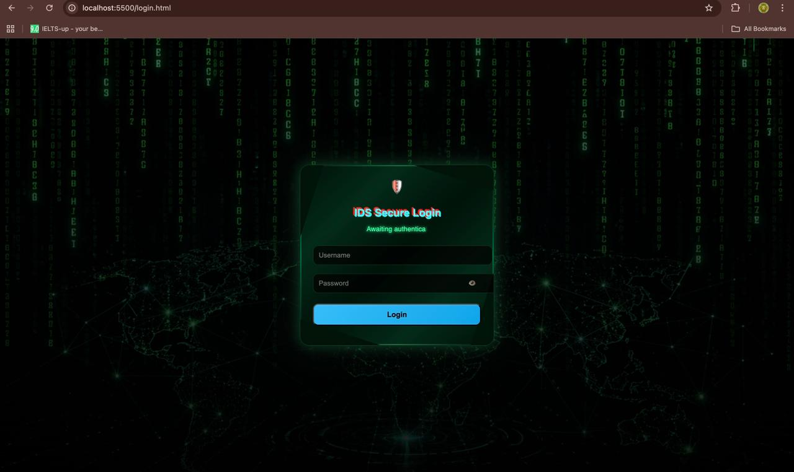
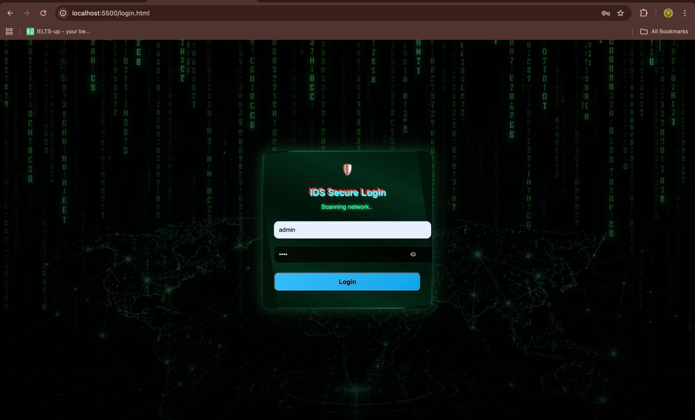
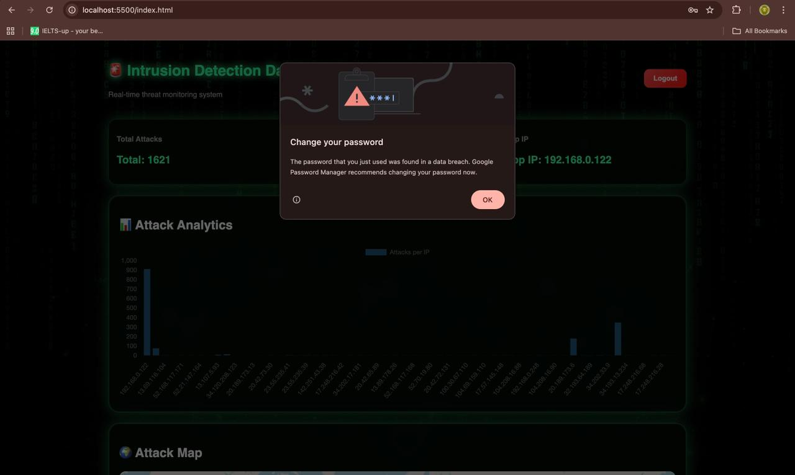
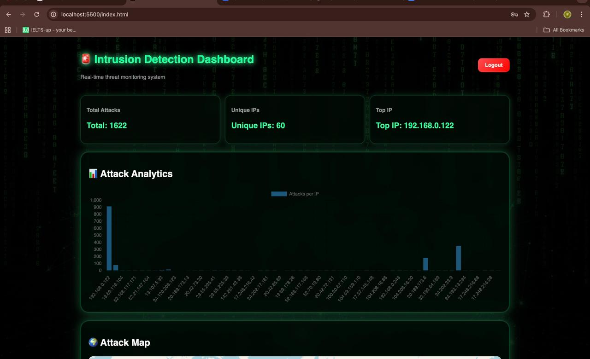
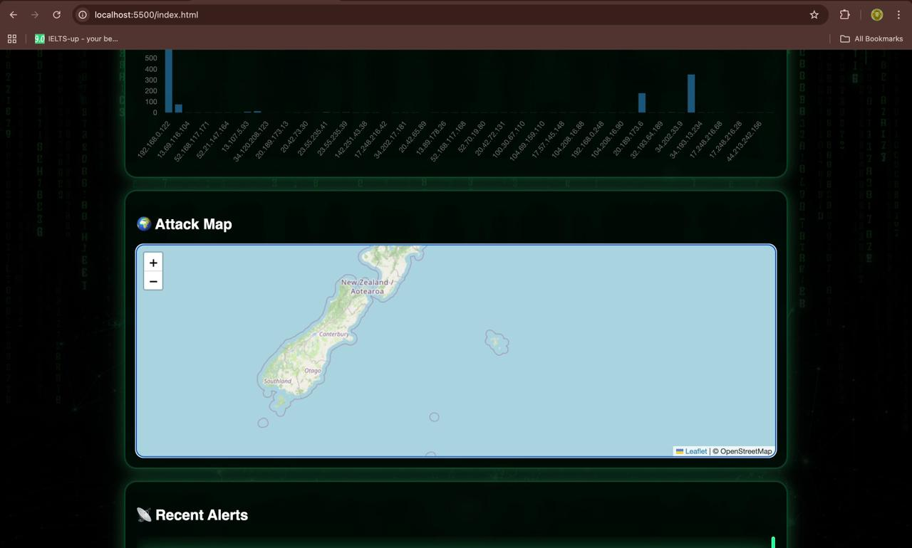
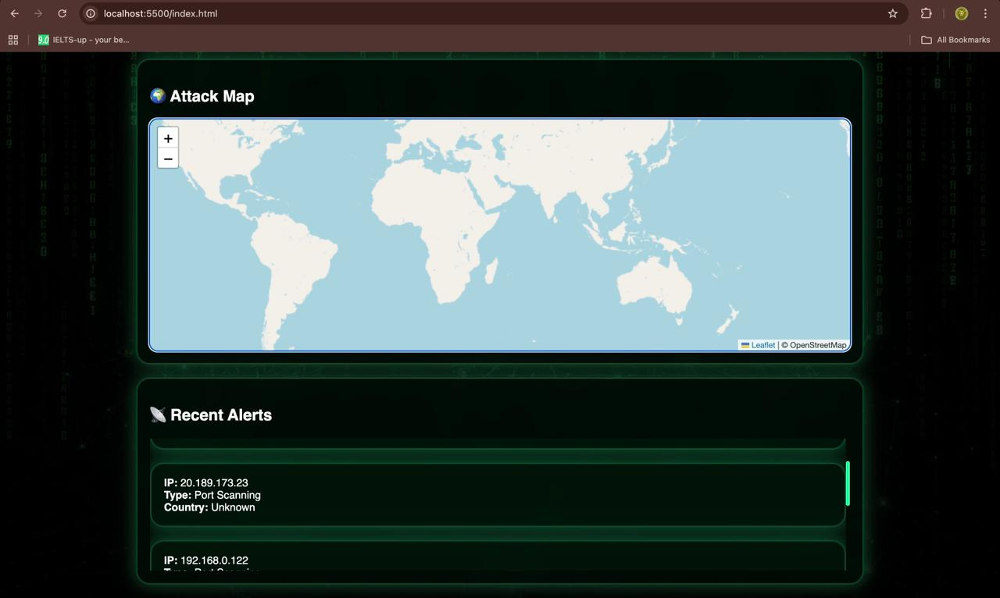

# 🛡️ IDS Dashboard

A real-time **Intrusion Detection System (IDS) Dashboard** built with FastAPI and JavaScript.
It provides live threat monitoring, attack analytics, and interactive visualization.

---

## 🚀 Features

* 🔐 Secure Login System (JWT Authentication)
* 💻 Hacker-style animated login UI
* 📊 Real-time Attack Analytics (Chart.js)
* 🌍 Interactive Attack Map (Leaflet)
* 📡 Live Threat Monitoring

---

## 📸 Screenshots

### 🔐 Login Interface



### ⌨️ Typing / Scanning Effect



### 🔍 Login Scanning State



### 📊 Dashboard Overview



### 🌍 Attack Map



### 📡 Recent Alerts



---

## 🛠️ Tech Stack

* **Frontend:** HTML, CSS, JavaScript
* **Backend:** FastAPI (Python)
* **Visualization:** Chart.js, Leaflet

---

## ⚙️ How to Run (Step-by-Step)

### 1️⃣ Clone the Repository

```bash
git clone https://github.com/rdrajibcyber21/ids-dashboard.git
cd ids-dashboard
```

---

### 2️⃣ Start the Backend (FastAPI)

Make sure Python is installed.

```bash
cd backend   # skip if backend is in root

pip install -r requirements.txt

uvicorn main:app --reload
```

👉 Backend will run at:
http://127.0.0.1:8000

---

### 3️⃣ Start the Frontend

```bash
cd frontend
python3 -m http.server 5500
```

👉 Open in browser:
http://localhost:5500/login.html

---

### 4️⃣ Login Credentials

```
Username: admin
Password: 1234
```

---

### 5️⃣ Access Dashboard

After login:
http://localhost:5500/index.html

---

## ⚠️ Notes

* Backend must be running for data to load
* API endpoints used:

  * `/stats`
  * `/alerts`
* If needed, enable CORS in FastAPI

---

## 👨‍💻 Author

**Rajib Das**
Cyber Security Enthusiast
